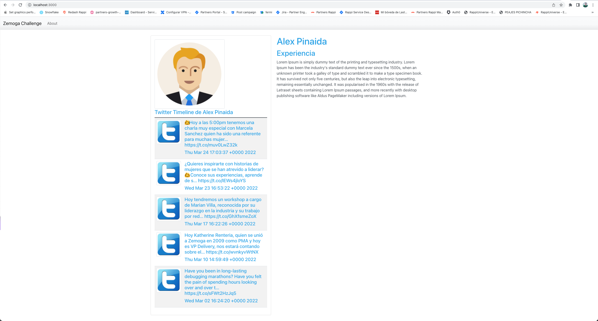

# ZEMOGA FRONTEND CHALLENGE

## Description

Build a simple portfolio page with the user info, image, title, text description and a list of 5 tweets of the user timeline. Do not pay much attention to the UI/ design side of things. The focus of the test should be the back-end side of things.

### Requirements

- Docker
- npm

### Example

### Tech Stack

Name | Description | Useful Resources
--- | --- | ---
React | Is a JavaScript library for building user interfaces.| [Official site](https://reactjs.org/) resources.
React Router | Is a routing library for React.| [Official site](https://reacttraining.com/react-router/web/guides/quick-start) resources.
Npm | Is a package manager for the JavaScript programming language.| [Official site](https://www.npmjs.com/) resources.
Docker | Is a software package management system for maintaining development environments.| [Official site](https://www.docker.com/) resources.

### Requirement before run

- This project has backend project. You can access in this link: https://github.com/JaviAPS94/zemoga-challenge
- Run the frontend with the guidelines given in the Readme.

### How to run?

1. Clone the frontend repository
2. In root directory run `docker build -t zemoga-frontend .`
3. Run `docker run -dp 3000:3000 zemoga-frontend`

### Contributors

- Alex Pinaida

### How long will it take me to do this challenge?

- Around 8 hours in the backend and around 2 hours in the frontend.

### License

This project is property of Alex Pinaida